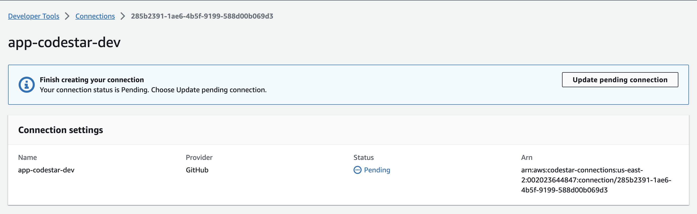

# SpringBoot PetClinic Application Deployment

This repository contains the codebase for the "PetClinic" Java Spring Boot application and includes the necessary Terraform scripts for infrastructure setup and scripts for CI/CD using AWS CodePipeline. The application is configured for deployment on AWS EC2 instances in autoscaling group with an RDS backend.

## Architecture Diagram

Some considerations from architectural and reliability perspective, if following changes are made:
- Using EC2 in ASGs, minumum count is increased to `2`
- RDS database Multi-AZ variable is set to `true`

We can achieve the following:
- Recovery Time Objective (RTO) is the targeted duration of time within which a business process must be restored. It can be within minutes.
- Recovery Point Objective (RPO) is the maximum targeted period in which data might be lost. EC2 does not store data and state in this case, and for RDS multi-AZ database, the RPO is essentially zero, as the database is synchronously replicated.

Thus, by making above two changes, we can make sure the architecture is further more reliable and is highly available as well, with a very short RTO and RPO. 

## Prerequisites

- An AWS account
- Configured AWS CLI with necessary access
- Terraform v1.4.3 installed on your local machine
- Basic knowledge of Java, Spring Boot, AWS, Terraform, and CI/CD concepts

## Repository Structure

- `/` - Java Spring Boot application codebase (PetClinic)
- `infra/` - Terraform scripts for provisioning AWS infrastructure
- `scripts/` - Auxiliary scripts for application setup and configuration during CI/CD

## Setting Up Infrastructure with Terraform

- Setup AWS CLI with profile named *aws_profile*.
- Navigate to the `infra/` directory.
- Customize the `terraform.tfvars` file with your environment-specific values. Make sure the following variables are configured as required:
  - **repository_id:** Required repository ID in GitHub in username/repository format.
  - **hosted_zone_id:** Hosted Zone ID for Route53 to use for application records
  - **domain_record:** Domain record to create for application hosting.
  - **repository_branch:** As required, the branch can be configured to trigger the pipeline. By default, *main* branch is selected.
  - **common_tags.Environment:** the environment tag is set to dev by default. If this is changed, change the following files as well to match the environment:
    - buildspec.yml
    - scripts/run_app.sh
- Initialize the Terraform workspace with `terraform init`.
- Apply the Terraform scripts with `terraform apply`.
- Verify the infrastructure setup in AWS Console.

## Application Deployment with AWS CodePipeline
- Once the infrastructure is provisioned, make sure to complete the AWS CodeStar connection, to ensure CodePipeline is connected to GitHub repository.
- Navigate to AWS CodeStar connection [page](https://us-east-2.console.aws.amazon.com/codesuite/settings/connections?region=us-east-2) and region where infrastructure is provisioned. Click on *Update pending connection* and follow prompts in browser window to install the connection app:

- Once successfully installed, the status should change to *Available*.
- Navigate to AWS CodePipeline page where pipeline is created and click on *Release changes*.

- AWS CodePipeline is divided into 3 phases:
  - **Source:** Trigger the pipeline as per selected branch and forwards the artifacts for build
  - **Build:** This stage performs required actions related to build and test lifecycle of application using buildspec.yml. It performs the following actions:
    - Code is validated and compiled
    - Tests are run on the compiled source code using a suitable test framework. Following is a screenshot of successful tests:
      
    - Post-testing, code is packaged and verified, readying it for deployment
  - **Deploy:** AWS CodeDeploy is used to deploy the application on AWS EC2 instances using appspec.yml reference file and provided scripts
- Verify all the steps in pipeline run successfully and that the application is deployed to the newly created infrastructure.

## Accessing the Application
After a successful deployment, you can access the PetClinic application:
- Navigate to AWS Target Groups and wait for registered target to get healthy. Once it is healthy it should look as following:

- Retrieve the domain name of application configured previously AWS Console.
- Open a web browser and navigate to `https://<DOMAIN_RECORD_VARIABLE>/petclinic/`.
- You should now see the PetClinic application running.

## Security and Permissions
-  EC2 Instance Connect Endpoints are used so bastion or ec2-pem file is not required to SSH into servers.
  **Note:** If region is changed, respective AWS IPs (from [this](https://github.com/joetek/aws-ip-ranges-json/blob/master/ip-ranges-ec2-instance-connect.json) link) are to be whitelisted in security group named *instance_connect_sg* to ensure Instance Connect works as expected. Instance connect endpoint can be used as following from AWS Console:
    

- Password for RDS database server master username is created using terraform random module, using specific length and use of special characters. The value is directly passed to RDS password as a secure parameter and is also stored in SSM Parameter store to be used later on for connecting to it.
- Security Groups are tightly scoped, and all resources only allow specific traffic required for it.
  - **EC2:** Only allows traffic from ALB security group on port 9966 for tcp protocol. And traffic from Instance connect for SSH port 22.
  - **ALB:** Since this is the point of contact for public traffic towards application, the traffic is allowed from 0.0.0.0 only on specific HTTP (80) and HTTPS (443) ports. All traffic from port 80 is redirected to 443 for SSL termination.
  - **CodeBuild:** AWS CodeBuild does not require any incoming traffic, so no ingress rules are created for its security group.
  - **Database:** RDS for MySQL is only accessed from EC2 servers for application connectivity and CodeBuild during tests. It is only allowed traffic to MySQL port 3306 from their respective security groups.
- AWS Certificate Manager (ACM) certificates with Application Load Balancer (ALB) are used, ensuring end-to-end encryption. This setup automates the renewal and deployment of certificates and also leverages the security benefits of ALB, including automatic cipher updates and integrations with AWS WAF for additional layers of protection. 
  The certificate is created using terraform with the *domain* variable provided. 
- IAM least privileged principle is used. For all the entities, the permissions created using terraform with specific policies only allow specific Actions on specific resources as required.
- Encryption for data-at-rest is implemented for our infrastructure securing both our computing and database resources:
  - **EBS Encryption:** Elastic Block Store (EBS) volume attached to our EC2 instances are encrypted with AWS's default EBS encryption.
  - **RDS Encryption:** AWS RDS instances are secured with RDS encryption, employing AWS's default encryption keys. This feature protects our stored data, automated backups, read replicas, and snapshots using the AES-256 encryption algorithm.

## Considerations and Future Work

While our current deployment of the SpringBoot PetClinic application on AWS via Terraform and AWS CodePipeline demonstrates a robust and functional infrastructure, there are several areas where further enhancements and refinements can be made. Below are outlined key considerations and potential future work to improve our setup:

### 1. Security Enhancements
- Implementing Custom KMS Keys
- IAM Policies and Roles refinement

### 2. Architecture Improvements
- Containers and Orchestration
- Designing for Multi-Region deployment or implementing DR plan

### 3. Observability and Monitoring
- Enhanced Logging and Monitoring for improved insight into application performance and infrastructure health
- Automated Alerting implementation to detect, escalate, and respond

### 4. Cost Optimization
- Right-Sizing Resources
- Consider Spot Instances where applicable, keeping in mind the trade-offs in availability

### 5. CI/CD Enhancements
- Extensive testing in the CI/CD Pipeline and implementing branching development cycle
- Blue/Green Deployment to reduce downtime and risk

### 6. IaC Improvements
- Modules can be created for resources for reusability
- Terraform state can be moved to remote backend, enabling collaboration between team members, versioning state files, and providing a history of changes

As we continue to iterate on this project, the goal is to address these considerations, integrating more sophisticated features, enhancing security, and ensuring high availability and reliability.

## Contributions
If you wish to contribute to this project, please fork the repository and submit a pull request.
